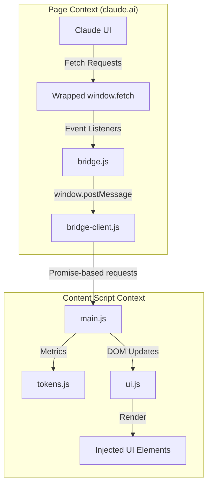

# Claude Counter Implementation Analysis

This document provides a comprehensive technical breakdown of the **Claude Counter** browser extension based on the analysis of its codebase.

## 1. Overall Architecture

The extension follows a standard Manifest V3 structure but employs a **dual-context architecture** to bypass standard content script limitations when interacting with the host page's internal state and network requests.

### Key Components
*   **Content Scripts (`src/content/`)**: Runs in an isolated world. Manages the UI injection and high-level logic.
    *   `main.js`: Orchestrator of the extension.
    *   `ui.js`: Handles DOM creation, styling updates, and tooltips.
    *   `tokens.js`: Implements token counting and caching logic.
    *   `bridge-client.js`: The content-script-side interface for communicating with the page context.
*   **Injected Script (`src/injected/bridge.js`)**: Injected directly into the `claude.ai` page context. This allows it to wrap `window.fetch` and access the page's `history` object, which is necessary for intercepting API responses and SPA navigation events.
*   **Vendor Library (`src/vendor/o200k_base.js`)**: A large file (approx 2MB) containing the tokenizer data and logic for the `o200k_base` (GPT-4o/Claude 3) encoding.
*   **Manifest (`manifest.json`)**: Defines permissions, content scripts, and web-accessible resources (required for the bridge injection).

### System Interaction

---

## 2. Implementation Details

### Core Feature Workflows

#### A. Token Counting
1.  **Extraction**: `tokens.js` traverses the conversation object. It identifies "countable" items:
    *   Text blocks.
    *   Tool use/result (deterministically stringified).
    *   Extracted content from attachments.
2.  **Fingerprinting**: To avoid re-tokenizing the entire history on every message, it generates a fingerprint for each message (`length:SHA-256 hash`).
3.  **Caching**: It uses `TokenCache` to store token counts for messages. If the fingerprint hasn't changed, it returns the cached count.
4.  **Tokenization**: Uses `gpt-tokenizer` (`o200k_base`) to convert text to tokens locally.

#### B. API Interception
1.  `bridge.js` wraps `window.fetch`.
2.  It monitors URLs for:
    *   `/chat_conversations/{id}?tree=true`: Fetches the conversation data.
    *   `/completion` / `/retry_completion`: Signals a generation starts (starting the "pending cache" UI state).
3.  **SSE Monitoring**: It reads the `event-stream` response for message generations. It looks for `message_limit` chunks to update usage statistics in real-time without polling.

---

## 3. Browser APIs Used

| API | Purpose | Rationale |
| :--- | :--- | :--- |
| `chrome.runtime.getURL` | Bridge Injection | To get the absolute URL of `bridge.js` to inject it into the page. |
| `window.postMessage` | Inter-context Comms | To send data between the Page Context and the Content Script Context. |
| `MutationObserver` | DOM/URL Tracking | To detect when Claude's UI elements appear and to monitor SPA navigation. |
| `crypto.subtle` | Fingerprinting | To generate SHA-256 hashes for message content caching. |
| `document.cookie` | Auth | Reads `lastActiveOrg` to know which organization context to use for manual usage API calls. |
| `Web Accessible Resources` | Security | `bridge.js` must be declared here to be loadable via a `<script>` tag in the page. |

---

## 4. Feature Analysis

1.  **Token Count**: Displays approximate counts for the current conversation branch. Includes a mini-bar against a 200k limit.
2.  **Cache Timer**: Claude caches conversations for 5 minutes. The extension calculates this from the `last_assistant_message` timestamp and displays a countdown.
3.  **Usage Bars**:
    *   **Session (5h)**: Shows current usage and time-based marker for the reset window.
    *   **Weekly (7d)**: Shows long-term usage relative to the 7-day window.
4.  **Manual Refresh**: Clicking the usage bars triggers a manual fetch of the `/usage` endpoint.

---

## 5. Data Flow

1.  **Trigger**: User navigates to a chat or sends a message.
2.  **Capture**: `bridge.js` (page context) intercepts the `fetch` response.
3.  **Transport**: `bridge.js` sends the JSON data to the content script via `window.postMessage`.
4.  **Processing**: `main.js` receives the message, passes it to `tokens.js` for calculation.
5.  **Rendering**: `main.js` calls `ui.js` to update the DOM elements.
6.  **Manual Pull**: If `main.js` needs fresh data, it sends a request back to `bridge.js` via `postMessage`, which then performs a `fetch` and returns the result.

---

## 6. UI Integration

*   **Technology**: Vanilla JavaScript and CSS. No heavy frameworks (React/Vue) were used, likely to keep the extension lightweight and avoid conflict with Claude's own framework (Next.js).
*   **Injection Points**:
    *   **Header**: Placed near the Chat Menu trigger (`[data-testid="chat-menu-trigger"]`).
    *   **Usage Line**: Placed below the model selector/input area.
*   **Theme Support**: Listens to changes in `data-mode` on the `<html>` element to toggle between light and dark mode colors dynamically.

---

## 7. Build & Tooling

The project is **dependency-free** in the build sense:
*   No bundler (Webpack/Vite) is used for the extension itself.
*   Vendor scripts are manually placed in `src/vendor/`.
*   Deployment is manual (zipping the folder).
*   **Userscript Support**: Includes a standalone `claude-counter.user.js` that bundles all logic into one file for Greasemonkey/Tampermonkey users.

---

## 8. Reimplementation Guide

To build a similar system, follow these steps:

### Phase 1: Project Setup
1.  Create `manifest.json` (V3).
2.  Set up folder structure: `/src/content/`, `/src/injected/`, `/src/vendor/`, `/icons/`.
3.  Download a tokenizer (e.g., `gpt-tokenizer`).

### Phase 2: Building the Bridge
1.  Create `bridge.js`.
2.  Implement `window.fetch` proxy.
3.  Implement `history.pushState` proxy for SPA navigation.
4.  Add a `window.addEventListener('message', ...)` to handle requests from the content script.

### Phase 3: Content Script Logic
1.  Create `bridge-client.js` to handle the Promise-based communication with the bridge.
2.  Create `tokens.js` to handle token counting.
    *   *Tip*: Use `crypto.subtle.digest` for fast content hashing.
3.  Create `ui.js` to create and update DOM elements. Use `MutationObserver` to ensure elements are re-injected if Claude's UI re-renders.

### Phase 4: Orchestration
1.  In `main.js`, initialize the UI.
2.  Set up listeners for URL changes.
3.  Fetch initial usage data using intercepted organization IDs.
4.  Set up an interval (e.g., 1s) to update countdown timers.

### Phase 5: Testing
1.  Load the extension in "Developer Mode" in Chrome/Firefox.
2.  Navigate various conversation sizes.
3.  Test theme switching (Light/Dark).
4.  Verify usage bars update after sending messages.

---

## 9. Conclusion

This extension is a prime example of how to build deep integrations with a complex SPA by using a double-layered script approach. By injecting code into the page context, developers can overcome the sandbox limitations of content scripts while still maintaining the security and UI-injection benefits of the extension environment.
