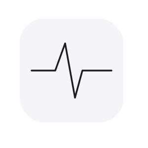

<p align="center">
  
</p>

<h1 align="center">Claude Pulse</h1>

<p align="center">
  <strong>The real-time metrics dashboard for your Claude conversations</strong>
</p>

<p align="center">
  
  
  
</p>

---

### ✨ Why Claude Pulse?

- **Token Counter** — Know your context window at all times. Live approximate counting using the `o200k_base` tokenizer.
- **Cache Timer** — Never miss the 5-minute cache window. A live countdown shows exactly when your next message will be cheaper.
- **Usage Progress Bars** — Visual monitoring of your 5-hour session and 7-day rolling limits with real-time percentage markers.
- **100% Private & Local** — No external servers, no tracking. All data is processed locally in your browser.
- **Native UI Integration** — Discreetly blends into Claude's interface for a premium, built-in feel.
- **Open Source** — MIT license, designed for the community.

---

### 📥 Installation

#### Chrome / Brave / Edge
1. Download or clone this repository
2. Open `chrome://extensions`
3. Enable **Developer mode** (top right)
4. Click **Load unpacked** and select the `claude-pulse` folder

#### Firefox
1. Download or clone this repository
2. Open `about:debugging#/runtime/this-firefox`
3. Click **Load Temporary Add-on**
4. Select the `manifest.json` file inside the `claude-pulse` folder

---

## 🚀 How it Works

Claude Pulse provides a transparent look into the "invisible" metrics of your Claude interactions. It works by intercepting the same API responses Claude's UI already fetches—usage stats, conversation trees, and streaming completions.

- **Security First**: The extension requires no special permissions and runs entirely within the `claude.ai` sandbox.
- **Tiktoken Integration**: Tokenization is powered by a local implementation of the `o200k_base` encoding, ensuring counts are as accurate as possible.
- **Real-time Synchronization**: Usage data is synced directly from Claude's `/usage` endpoint when you refresh the UI or send a message.

---

## 🖥️ UI Overview

<p align="center">
  <em>The injected metrics header displays tokens, cache status, and usage limits directly above your chat input.</em>
</p>

---

## 📁 Project Structure

```
claude-pulse/
├── manifest.json         # Extension configuration & permissions
├── icons/                # Extension branding (PNAs)
├── src/
│   ├── styles.css        # Premium UI styling & animations
│   ├── content/
│   │   ├── main.js       # Content script entry logic
│   │   ├── ui.js         # Component architecture (bars, tooltips)
│   │   ├── tokens.js     # Tiktoken-compatible counting logic
│   │   ├── constants.js  # DOM selectors & runtime constants
│   │   └── bridge-client.js # Message bridge for intercepted data
│   ├── injected/
│   │   └── bridge.js      # XHR/Fetch interceptor for raw API data
│   └── vendor/
│       └── o200k_base.js  # Optimized tokenizer encoding
└── claude_pulse_logo.svg # Source vector asset
```

---

## ⚖️ Accuracy & Privacy

### Data Accuracy
Token counts are **approximate**. Because Claude's internal system prompt and tokenizer specifics are not publicly exposed, counts exclude system overhead and may differ slightly from the official server count. The metric is intended as a high-fidelity guide, not an exact meter.

### Your Privacy
Claude Pulse is built on a "zero-trust" architecture regarding your data. 
- **No Analytics**: We do not track usage or extension interactions.
- **No Cloud**: No text or metadata ever leaves your machine.
- **Local Only**: All tokenization happens on-device using JavaScript.

---

## 🤝 Credits

Inspired by and building upon [Claude Counter](https://github.com/mechanicalAnt/claude-counter). This project is a modern reimplementation with a focus on premium UI and expanded metric tracking.

Tokenization powered by [gpt-tokenizer](https://github.com/niieani/gpt-tokenizer) (`o200k_base` encoding).
---

## 📄 License

MIT License — Feel free to contribute or fork for your own use.

---

<p align="center">
  Made with ❤️ for the Claude community
</p>
